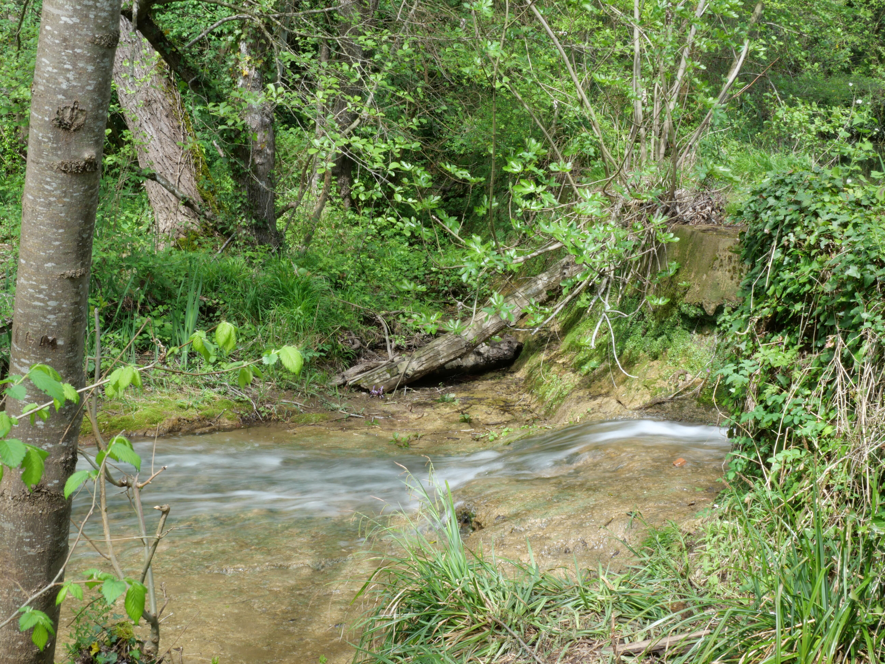

```{raw-cell}
.. post:: 23 Apr 2023
    :category: Blog
```

# Hello you all, in this World! 🌍

+++

This is my first post in this blog! I created this web page using sphinx with [pydata](https://pydata.org/) an [Ablog](https://ablog.readthedocs.io/en/stable/) themes.

I want to thank Chris Holdgraf, because I really got a big part of the setup from his blog, [you should check it up!](https://chrisholdgraf.com/)

I probably will do a recap on how i did this blog page, but for a first blog post, I want to tell you what I wanted:
* **A simple static website**: I have really thought about this, I have considered doing a [django](https://www.djangoproject.com/) website or even better, a [wagtail](https://wagtail.org/) site (wagtail is a CMS based on django). But I think it would add too much complexity. If I want to create applications I will probably use Plotly Dash, Taipy, Datapane, Streamlit... And having a django website won't help me much there either. Static is fine, I can always add some dynamism with JavaScript-based 
* **A website done with python**: I like python.
* **A website where I can host (jupyter) notebooks**: This was the huge main reason to go for this setup (and the reason I considered wagtail was because [The Data Frog blog](https://thedatafrog.com/fr/) uses it, with Jupyter Notebooks (if you are into Machine learning and/or data analysis with python, I really recomend you check it out!).

After some research, I found out Chris Holdgraf's blog, and here are some extra reasons for this setup that came after:

* **Sphinx**: I discovered Sphinx recently ([I wrote about it in the Medium post I did about the Pycon Fr 2023](https://medium.com/better-programming/notes-from-pycon-fr-2023-convention-part-1-52b1e44214c8#0e8d)). I wanted to master it, along with other related technologies, like [Jupyter Book](https://jupyterbook.org/en/stable/intro.html).
* **Markdown**: Sphinx default is ReStructuredText (rst files). But using MyST Markdown (and [MyST-NB, for notebooks](https://myst-nb.readthedocs.io/en/latest/index.html)) makes writing and integrating links very easy.
* **An easy workflow**: Like a water in a river, it should be easy and **fast** to write, create the blog post and deploy it.

+++

## Flowing like a river

As you can see below, it is very easy to add an image to my blog post. In this case, it is a small river I have close to home, with its water flowing smoothly, like the process of creating blog posts with this setup!.



+++

## Using jupyter Notebooks to blog: A great way to write about Data Analysis

Being able to write code and display the result, easely, is a huge advantage. Jupyter Notebooks is a very common tool, I personally use it a lot (and you can use other tools, like Visual Studio Code to display your .ipynb files). For example, I can do a a python "Hello World" for my Hello World post right here:

```{code-cell} ipython3
print("Hello World!🌍")
```

## Why I created this blog

I really like programming (with python or other languages) and I love working with data. But the ultimate goal of analyzing data, finding insights, is to communicate about it!

I recently started writing on [Medium](https://medium.com/@ericnarro), so I will give a different approach to both spaces (and other eventual spaces where I could create content, like on [youtube](https://www.youtube.com/@ericnarro/featured), social media, etc...). So here are a few differences I have in mind:

* My personal blog is also a portfolio, it centralizes all my other other accounts
* My blog will have a more technical approach (tutorials, code). On Medium I write reviews, give thoughts, etc
* I will probably integrate content and make it interact. For example, a tutorial could have a video version on youtube, a written description with code snippets on the website and a review on Medium...

All these are thoughts, I am just starting this and it will probably evolve over time!

Thank you for reading, do not hesitate to contact me or leave comments if you have any suggestions!
